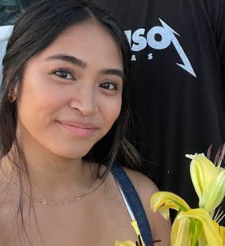
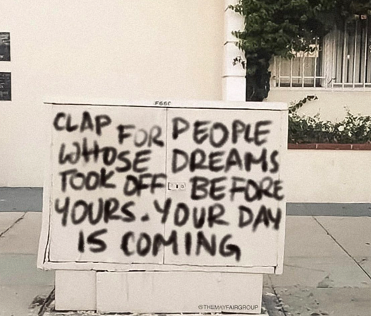

# Elyzha's little things ### 🌸 🌼 🌟 🌻 🍰 🍉 🦋 
My repository is about the little things in life that make me happy. 

## Bio
*2023 is my turn to grow.* My name is Elyzha and I am a Filipino-American from Seattle, WA. I have an interest in UX Design and creating products that are accessible to all users. 

I have always sought out to be the best that I can be academically. As I grew up, I also faced different obstacles that hindered my mindset into reaching the goals that I wanted to achieve. This year, I'm ready to take calculated risks to take new responsibilities to see how far I can go professionally and as an individual.

---

Here are some things that brought me joy 😊:
- The beach and the arcade bring me comfort
- Sharing genuine laughter with someone
- When I put together a Valentine's theme event for my work and received high feedback.

---

##The 4th thing - joining Year Up!

List 3 items about your Year Up Program Management journey that excites you
- I get to congratulate and celebrate my peers achievements along the way and see them be excited about their future.
- I am excited for the possibilities ahead and show myself what skills I am capable of.
- New friendships and connections in the workspace.

An accomplishment during your Year Up journey that you are most proud of and why
There are many things I could say that I'm proud of during the program. From adjusting to a morning schedule to learning to manage my time and balance between work and school.

---
 

